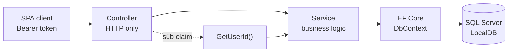
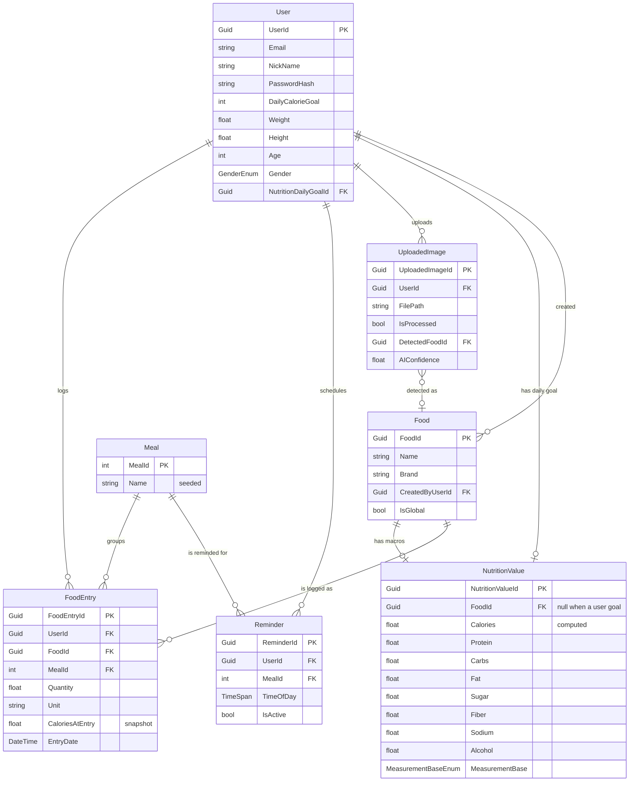

# NutriView API

[](https://dotnet.microsoft.com/)
[](https://learn.microsoft.com/aspnet/core/)
[](https://learn.microsoft.com/ef/core/)
[](https://learn.microsoft.com/sql/database-engine/configure-windows/sql-server-express-localdb)
[](https://jwt.io/)
[](https://swagger.io/)

REST API for **NutriView**, a calorie-tracking application built as a Master's thesis
project. It stores a food catalogue with full macro breakdowns, logs what a user eats
into meals, computes calories server-side, and tracks daily nutrition goals and meal
reminders.

Every endpoint except register and login is closed behind a JWT bearer token, and the
caller's identity is taken from the token rather than from anything the client sends.

The React front end that consumes this API lives in
[NutriView-React](https://github.com/NutriView/NutriView-React).

---

## Table of contents

- [Features](#features)
- [Tech stack](#tech-stack)
- [Architecture](#architecture)
- [Domain model](#domain-model)
- [Getting started](#getting-started)
- [Configuration](#configuration)
- [API reference](#api-reference)
- [Authentication and security](#authentication-and-security)
- [Testing](#testing)
- [Roadmap](#roadmap)
- [Related repositories](#related-repositories)

---

## Features

- **JWT authentication** — register and login return a signed access token; every
  other endpoint requires it.
- **Per-user data isolation** — food entries, reminders, uploaded images and the
  nutrition goal are always scoped to the caller. There is no way to ask for someone
  else's row.
- **Food catalogue** — foods carry a full `NutritionValue` (protein, carbs, fat,
  sugar, fiber, sodium, alcohol) expressed against a measurement base such as
  `Per100g`, `Per1oz` or `PerServing`.
- **Meal logging** — entries are grouped into the four meals seeded by migration
  (Breakfast, Lunch, Dinner, Snack).
- **Server-computed calories** — the client never supplies a calorie figure; the API
  derives it from the macros and stores a snapshot on each entry.
- **Daily nutrition goal** — an optional per-user macro target, with its calorie total
  computed by the same formula used for foods.
- **Meal reminders** — a time of day per meal, per user, that the client can act on.
- **Uploaded images** — records with a `DetectedFoodId` and `AIConfidence`, staged for
  the planned AI food-recognition feature (see [Roadmap](#roadmap)).
- **Swagger UI** in development, with an Authorize button wired to the bearer scheme.

## Tech stack

| Area | Choice |
| --- | --- |
| Runtime | .NET 10 |
| Web framework | ASP.NET Core Web API (controller-based) |
| Data access | EF Core 10, Code First with migrations |
| Database | SQL Server LocalDB |
| Auth | `Microsoft.AspNetCore.Authentication.JwtBearer` 10.0.9 |
| Password hashing | `PasswordHasher<User>` (PBKDF2-HMAC-SHA512, ASP.NET Core shared framework) |
| API docs | Swashbuckle.AspNetCore 10.2.3 |

## Architecture

Three layers, with a strict rule about what each one is allowed to do.



- **Controllers** do HTTP and nothing else: validate `ModelState`, read the caller's id
  from the token, pick the status code, and translate a `ValidationException` into a
  `400`. They never touch the `DbContext`.
- **Services** own all business logic and every EF Core query. Each user-owned method
  takes the caller's `Guid userId` as its first argument and scopes the query with it.
- **DTOs** are split into `Create` / `Update` / `Response` shapes per entity, so
  entities never cross the wire and a client cannot set a field it has no business
  setting.

```
NutriView.API/
├── Controllers/      Food, FoodEntry, Reminder, UploadedImage, User
├── Services/         one interface + implementation per controller, plus
│                     NutritionService (calorie maths) and TokenService (JWT issuing)
├── Models/
│   ├── Entities/     EF Core entities
│   └── DTOs/         Create / Update / Response DTOs, grouped per entity
├── Data/             ApplicationDbContext: Fluent API relationships and Meal seeding
├── Configuration/    JwtSettings, bound from the "Jwt" configuration section
├── Helpers/          ClaimsPrincipalExtensions (GetUserId), Gender and MeasurementBase enums
├── Exceptions/       ValidationException, mapped to 400 by the controllers
└── Migrations/       EF Core migrations
```

## Domain model



`NutritionValue` does double duty: attached to a `Food` it describes that food's
macros, and attached to a `User` (with `FoodId` left null) it is that user's daily
target. Two rules are worth calling out because the schema does not show them:

**Calories are derived, never accepted from the client.** `NutritionService` computes
them from the macros, subtracting half the fiber from carbs:

```
calories = protein * 4 + max(0, carbs - fiber / 2) * 4 + fat * 9 + alcohol * 7
```

**Entry calories are snapshotted.** `FoodEntry.CaloriesAtEntry` is written when the
entry is created, scaled from the food's base calories to the logged quantity. Editing
a food's macros afterwards changes future entries only — it never silently rewrites a
user's history.

## Getting started

### Prerequisites

- [.NET 10 SDK](https://dotnet.microsoft.com/download)
- [SQL Server LocalDB](https://learn.microsoft.com/sql/database-engine/configure-windows/sql-server-express-localdb)
  (installed with Visual Studio, or standalone with SQL Server Express)
- The EF Core CLI, if you do not already have it:

  ```
  dotnet tool install --global dotnet-ef
  ```

### Run it

```bash
git clone https://github.com/NutriView/NutriView-API.git
cd NutriView-API/NutriView.API

dotnet restore
dotnet ef database update      # creates NutriViewDb and seeds the four meals
dotnet run --launch-profile https
```

| Launch profile | URLs |
| --- | --- |
| `https` | `https://localhost:5000` and `http://localhost:5010` |
| `http` | `http://localhost:5183` |

Both profiles set `ASPNETCORE_ENVIRONMENT=Development` and open Swagger UI at
`/swagger`. Swagger is registered **in development only**; outside it the app serves
the API alone and enables HTTPS redirection.

To sign a request from Swagger UI, call `POST /api/User/register` or
`POST /api/User/login`, copy the `token` from the response, and paste it into the
**Authorize** dialog.

## Configuration

`appsettings.json`:

```jsonc
{
  "ConnectionStrings": {
    "DefaultConnection": "Server=(localdb)\\MSSQLLocalDB;Database=NutriViewDb;Trusted_Connection=True;"
  },
  "Jwt": {
    "Issuer": "NutriView.API",
    "Audience": "NutriView.Client",
    "Key": "",           // must be supplied — see below
    "ExpiryDays": 7
  }
}
```

`Jwt:Key` is the symmetric signing key and must be **at least 32 bytes**; the
application throws at startup rather than issue tokens nobody can trust.

`appsettings.Development.json` ships a development-only key so `dotnet run` works
straight after a clone. **Do not use it anywhere else.** Supply a real key out of
source control:

```bash
dotnet user-secrets set "Jwt:Key" "<a long random value>"
# or as an environment variable
setx Jwt__Key "<a long random value>"
```

CORS is currently pinned to `http://localhost:5173`, the Vite dev server origin used
by the React client. Credentials are not allowed — the client holds the token in
`localStorage`, not in a cookie — so add your own origin there before deploying a
front end elsewhere.

## API reference

All routes are under `/api` and require `Authorization: Bearer <token>` unless marked
**anonymous**.

### Auth

| Method | Route | Body | Returns |
| --- | --- | --- | --- |
| `POST` | `/api/User/register` *(anonymous)* | `UserCreateDTO` | `201` + `{ token, expiresAt, user }`; `400` on a duplicate email or invalid body |
| `POST` | `/api/User/login` *(anonymous)* | `LoginDTO` | `200` + `{ token, expiresAt, user }`; `401` on bad credentials |

### User

| Method | Route | Returns |
| --- | --- | --- |
| `GET` | `/api/User/me` | `200` + `UserResponseDTO` |
| `PUT` | `/api/User/me` | `204`; `404` if the account is gone |
| `DELETE` | `/api/User/me` | `204` |
| `GET` | `/api/User/me/nutrition-goal` | `200` + `NutritionValueDTO`; `404` if none is set |
| `PUT` | `/api/User/me/nutrition-goal` | `204` |

### Food

The catalogue is shared: `GET /api/Food` returns every food, global or user-created.

| Method | Route | Returns |
| --- | --- | --- |
| `GET` | `/api/Food` | `200` + `FoodResponseDTO[]` |
| `GET` | `/api/Food/{id}` | `200`; `404` |
| `POST` | `/api/Food` | `201` + the created food |
| `PUT` | `/api/Food/{id}` | `204`; `404` |
| `DELETE` | `/api/Food/{id}` | `204`; `404` |

### FoodEntry, Reminder, UploadedImage

These three are user-owned and share the same shape. Replace `{resource}` with
`FoodEntry`, `Reminder` or `UploadedImage`.

| Method | Route | Returns |
| --- | --- | --- |
| `GET` | `/api/{resource}/me` | `200` + the caller's rows |
| `GET` | `/api/{resource}/{id}` | `200`; `404` if it is missing **or not yours** |
| `POST` | `/api/{resource}` | `201` + the created row |
| `PUT` | `/api/{resource}/{id}` | `204`; `404` |
| `DELETE` | `/api/{resource}/{id}` | `204`; `404` |

### Example

```bash
# 1. Register and keep the token
TOKEN=$(curl -s -X POST http://localhost:5010/api/User/register \
  -H "Content-Type: application/json" \
  -d '{"email":"demo@nutriview.test","password":"Passw0rd!","nickName":"Demo","dailyCalorieGoal":2200}' \
  | jq -r .token)

# 2. Log 150 g of a food as breakfast (mealId 1)
curl -s -X POST http://localhost:5010/api/FoodEntry \
  -H "Authorization: Bearer $TOKEN" -H "Content-Type: application/json" \
  -d '{"foodId":"<a food id>","mealId":1,"quantity":150,"unit":"g","entryDate":"2026-08-20T08:00:00Z"}'

# 3. Read the log back — no user id anywhere in the request
curl -s http://localhost:5010/api/FoodEntry/me -H "Authorization: Bearer $TOKEN"
```

## Authentication and security

**Identity comes from the token, not from the request.** The JWT carries the user id in
its `sub` claim; `ClaimsPrincipalExtensions.GetUserId()` is the single place it is
read. No route takes a user id and no `Create` DTO has a `UserId` property, so a client
cannot claim to be somebody else by editing a URL or a JSON body.

**Ownership is enforced by the query, and a miss looks like a miss.** Services filter
on `UserId` as part of the lookup, so another user's row is indistinguishable from one
that does not exist: you get `404`, not `403`. The API never confirms that a row you
cannot see is there.

**Token validation is strict.** Issuer, audience, lifetime and signature are all
checked, and `ClockSkew` is set to `TimeSpan.Zero` — the default five-minute grace
period past expiry is off. `MapInboundClaims` is disabled so claims keep their raw JWT
names instead of being rewritten to legacy WS-Federation URIs.

**Passwords.** Hashed with `PasswordHasher<User>` — PBKDF2-HMAC-SHA512 with a random
per-user salt, so two accounts with the same password store different hashes. Login
honours `SuccessRehashNeeded`, upgrading a hash in place when the framework's
parameters move on. Plaintext is never stored, and `PasswordHash` is not a property on
any response DTO.

**Startup guard.** A `Jwt:Key` shorter than 32 bytes aborts startup with an explicit
message, so a misconfigured deployment fails loudly instead of signing tokens with a
weak key.

### Known limitations

Documented rather than glossed over:

- **Access token only.** There is no refresh token and no revocation list, so a leaked
  token stays valid until `expiresAt` (7 days by default). Shorten `Jwt:ExpiryDays` if
  that matters more than the extra logins.
- **The food catalogue is not access-controlled.** `Food.CreatedByUserId` is populated,
  but `PUT` and `DELETE` on `/api/Food/{id}` do not check it — any authenticated user
  can edit or delete any food, including global ones. Acceptable for a thesis demo, not
  for production.
- **Uploaded images are metadata only.** `FilePath` is a string the client supplies;
  the API does not accept, store or validate the file itself.

## Testing

There is no unit-test project yet. `tests/test-auth.ps1` is an end-to-end smoke test of
the authentication and isolation model: **40 checks** against a running API, covering

- every endpoint refusing an unauthenticated request,
- register, duplicate-email rejection, login, wrong password, unknown email,
- tampered and malformed tokens,
- one user failing to read, update or delete another's food entry, and their lists
  staying separate,
- per-user nutrition goals and reminders,
- server-side calorie computation,
- and a `sqlcmd` check that two accounts registered with the **same** password have
  **different** stored hashes — which is what per-user salting buys you.

It creates two throwaway accounts and deletes them again at the end.

```powershell
# terminal 1
cd NutriView.API
dotnet run --launch-profile https

# terminal 2, from the repository root
.\tests\test-auth.ps1
```

The hash checks need `sqlcmd` on `PATH`; without it those four checks are skipped and
the rest still run.

## Roadmap

Not built yet:

- AI food recognition from `UploadedImage`, filling in `DetectedFoodId` and `AIConfidence`
- LLM integration for food descriptions and suggestions
- A daily nutrition summary endpoint (totals against the user's goal)
- Statistics endpoints backing the dashboard charts
- Server-side reminder scheduling and delivery

## Related repositories

- [NutriView-React](https://github.com/NutriView/NutriView-React) — the client: a
  React 19 + TypeScript PWA built with Vite, Mantine and TanStack Query, with its API
  types generated from this project's Swagger document.
